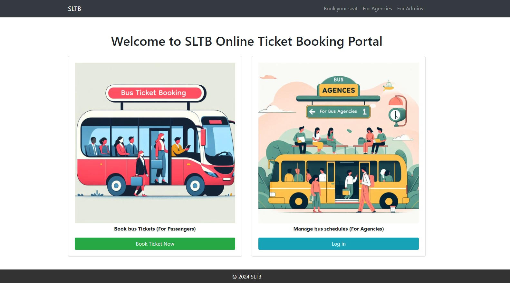
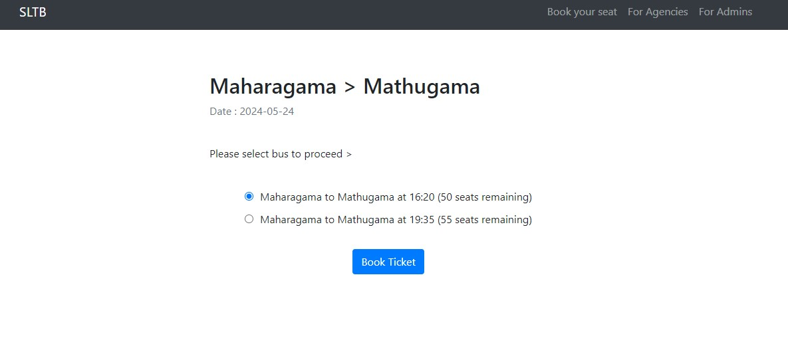
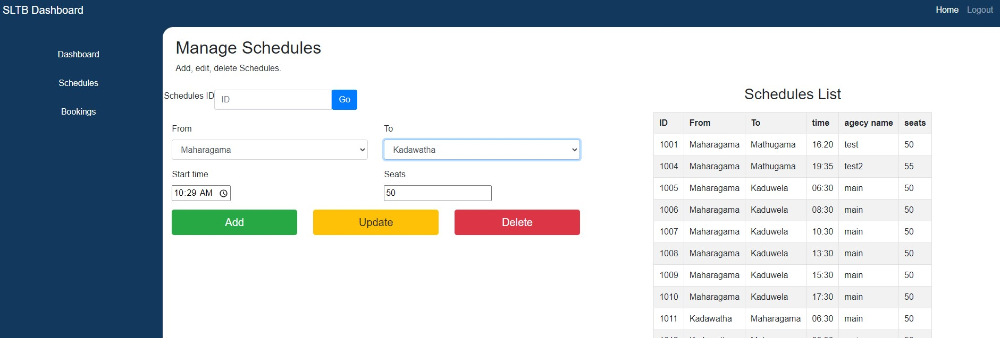
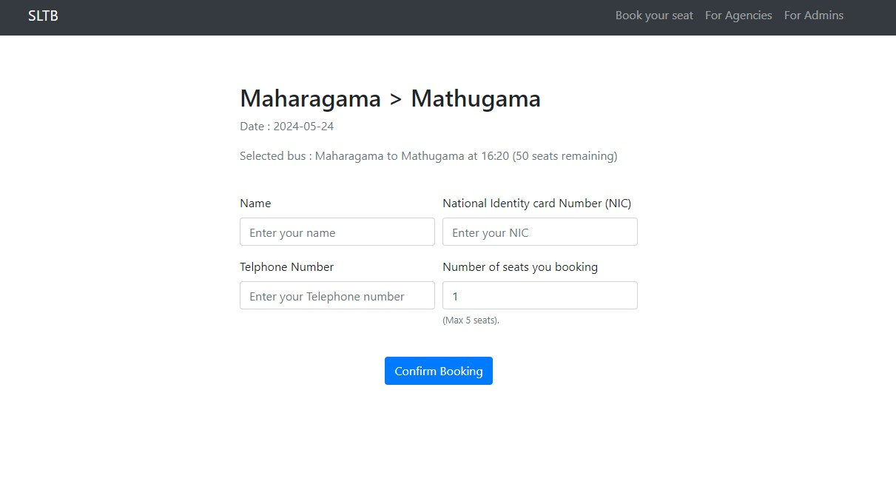
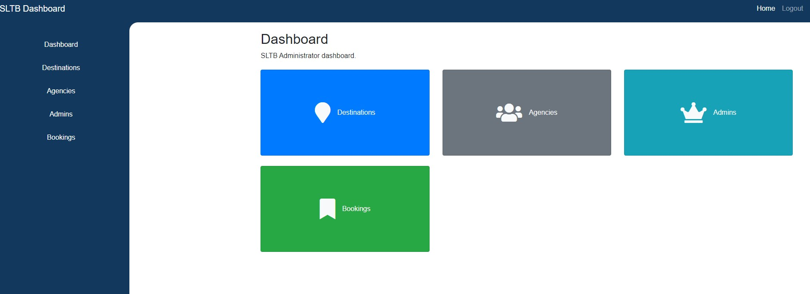

# Online Bus Ticket Booking System for Sri Lankan Transport Board

This project is a **comprehensive online bus ticket booking system** developed for the Sri Lankan Transport Board. It is built using **C#, ASP.net**, and **MS SQL** as a web application. Additionally, a web service is created using **ASMX** for future scalability.

## Features of the System

#### Passengers
- **Book Tickets:**
  - No account creation needed.
  - Select the route.
  - Choose from available bus schedules (view available seats).
  - Enter details: Name, Email, NIC, Number of seats.
  - Book the seat.

#### Bus Agencies
- **Manage Schedules:**
  - Log in to the system.
  - Create and manage bus schedules.
  - View bookings related to their agency.

#### Admins
- **System Management:**
  - Add and manage agencies.
  - Manage routes.
  - Manage schedules.

## Technologies Used

- **C#**
- **MS SQL**
- **ASP.net**

The project was developed using **Visual Studio 2015**.

## Web Service

A web service using **ASMX** has been created for future scalability, allowing easy integration with other systems or platforms.

## Screen Shots

Home page

Select bus schedule

Agency dashboard

Passanger ticket booking

Admin dashboard

## Architecture and Code Structure

The project follows a modular architecture to ensure clean, maintainable, and scalable code. The system is structured to handle various types of users efficiently.

## User Interface

The user interface is designed to be user-friendly, responsive and intuitive, ensuring a seamless experience for passengers, agencies, and admins.

## Getting Started

To run this project locally, follow these steps:

1. Clone the repository.
2. Set up your development environment with Visual Studio 2015.
3. Configure the MS SQL database and update the connection strings accordingly.
4. Build and run the application in Visual Studio.

## Contributors

Designed and developed by [Anushka Lakshan](https://github.com/YourUsername)
